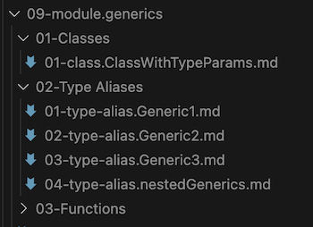
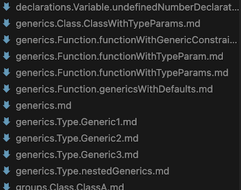

# Options guide

## outputFileStrategy

**type** `"members" | "modules"` • **default** `members`

> Determines how output files are generated.

TypeDoc creates documentation according to exports. The structure will be driven by the implemented entryPoints config. https://typedoc.org/guides/options/#entrypointstrategy.

This options aims to provide some flexibility as to how files can be generated.

**"members"**

Generates an individual file for each exported member. This is the standard behaviour of the HTML theme and the plugin default.


**"modules"**

Generates a single file for every Module or Namespace where all members are hoisted to a single module file. This creates a flat navigation structure and reduces the amount of files generated.


## includeFileNumberPrefixes

**type** `boolean` • **default** `false`

> Prefixes generated files and folders with number prefixes.

This makes files and folders appear in the file system in the same order as they are sorted. This is useful where auto sidebar generation may be required.



## flattenOutputFiles

**type** `boolean` • **default** `false`

> Flatten output files without folders.

This creates a flat folder structure without any folders - a required format for some Wikis.



## entryFileName

**type** `string` • **default** `README.md`

> The file name of the entry page.

`README.md` is recognised when browsing folders on repos and Wikis. `index.md` might be better if published as a web site.

Note the content of this file is either the API entry / index page, or the project readme (dependant on if a readme file is resolved or not).

a. If a readme file is resolved then two root files are generated:

├── {entryFileName} - (the project readme file)
├── API.md - (API index page)

b. If a readme file is NOT resolved, then the index page becomes the entryFileName page.

├── {entryFileName} - (API index page)

## indexFileName

**type** `string` • **default** `API.md`

> The file name the seperate index page.

This page either contains the module index or exported symbols depending on the given `entryPoints`.

This page may not be required (if navigation is present for example) and can be skipped. See `skipIndexPage`.

This option is ignored if `readme=none` or `skipIndexPage=true`.

## indexPageTitle

**type** `string` • **default** `undefined`

> The title of API index page.

If not defined then the project name / version will be printed.

## skipIndexPage

**type** `boolean` • **default** `false`

> Skips generation of a seperate API index page.

This option skips the generation of the index page if it is not required.

Please note this option will be ignored if a single entryPoint is defined as it will contain exported symbols.

## excludeGroups

**type** `boolean` • **default** `false`

> Excludes grouping by reflection kind so all members are rendered and sorted at the same level.

By default members are grouped by kind (eg Classes, Functions etc).

This creates a flat structure where all members are displayed at the same level.

**With groups**

```markdown
# SomeModule

## Classes

### ClassA

## Functions

### FunctionA
```

**Without groups**

```markdown
# SomeModule

## ClassA

## FunctionA
```

## hidePageHeader

**type** `boolean` • **default** `false`

> Do not print page header.

## hidePageTitle

**type** `boolean` • **default** `false`

> Do not print page title.

## hideBreadcrumbs

**type** `boolean` • **default** `false`

> Do not print breadcrumbs.

## hideInPageTOC

**type** `boolean` • **default** `false`

> Do not render in-page table of contents items.

## hideHierarchy

**type** `boolean` • **default** `false`

> Do not print reflection hierarchy.

## identifiersAsCodeBlocks

**type** `boolean` • **default** `false`

> Format signature and declaration identifiers in code blocks.

Note if `true` references will not be linked.

## propertiesFormat

**type** `"list" | "table"` • **default** `list`

> Specify the render style of properties groups for interfaces and classes.

## enumMembersFormat

**type** `"list" | "table"` • **default** `list`

> Specify the render style of Enum members.

## typeDeclarationFormat

**type** `"list" | "table"` • **default** `list`

> Specify the render style for type declaration members.

## tocFormat

**type** `"list" | "table"` • **default** `list`

> Render TOC either as a simple list or a table with a description.

## baseUrl

**type** `string` • **default** `undefined`

> Specifies the base url for internal link. If omitted all urls will be relative.

## anchorFormat

**type** `"lowercase" | "slug" | "none"` • **default** `lowercase`

> The anchor format to use when linking to internal symbols.

## anchorTemplate

**type** `string` • **default** `undefined`

> The anchor template to use when linking to internal symbols.

Supports {anchor} placeholders.

An example use-case is for bitbucket cloud that would use the option

```
anchorTemplate: 'markdown-header-{anchor}'
```

## titleTemplate

**type** `string` • **default** `{title}`

> Specify a template for displaying page titles.

Supports {kind} and {title} placeholders.

```
titleTemplate: "{kind}: {title}"
```

## namedAnchors

**type** `boolean` • **default** `false`

> Use HTML named anchors for engines that do not automatically assign header ids.
